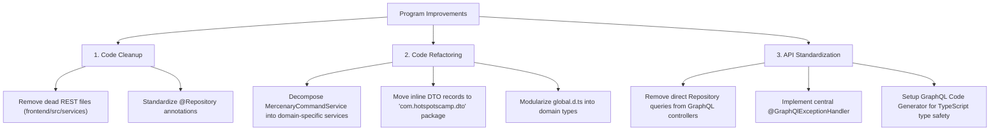

# HotSpots Campaigner - Program Evaluation & Improvement Report

This report provides a comprehensive architectural evaluation of the HotSpots Campaigner application. It highlights the codebase's strengths, maps technical debt, and provides actionable recommendations to improve performance, maintainability, and code quality.

---

## 1. Executive Summary

HotSpots Campaigner is a modern web application built on a highly performant stack:
*   **Backend**: Java 25, Spring Boot 3.5.14, Spring Data R2DBC (fully reactive non-blocking pipeline via Project Reactor), and Spring GraphQL.
*   **Frontend**: React 19, TypeScript, Vite, and Apollo Client.

The application has recently completed several significant refactoring steps (extracting pilot calculation logic, unit pricing logic, and AAR financial utility functions) and migrated its API layer from REST to GraphQL. However, several architectural anti-patterns, placement violations, dead code, and standard consistency gaps remain.

---

## 2. Key Strengths of the Program

*   **End-to-End Reactive Architecture**: The backend utilizes non-blocking `Mono` and `Flux` reactive structures across repositories, services, and controllers, allowing for highly efficient, concurrent operation processing.
*   **Clean Entity Layer Patterns**: Domain entities in [com.hotspotscamp.entity](file:///d:/dev/HotSpotsCampaigner/backend/src/main/java/com/hotspotscamp/entity) follow a highly consistent pattern, utilizing Lombok builders, extending R2DBC `Persistable<UUID>` interface, and safely managing database insertion state via `isNew` boolean flags.
*   **Extracted Core Logic (Clean Code)**: Core computation-heavy routines are decoupled from presentation components:
    *   Pilot SP calculations are isolated in [pilotCalculations.ts](file:///d:/dev/HotSpotsCampaigner/frontend/src/util/pilotCalculations.ts).
    *   Warchest transactions and repair costs are isolated in [financialUtils.ts](file:///d:/dev/HotSpotsCampaigner/frontend/src/util/financialUtils.ts) and [pricingUtils.ts](file:///d:/dev/HotSpotsCampaigner/frontend/src/util/pricingUtils.ts).
*   **Rule-Driven Flexibility**: [RuleConfigurationService.java](file:///d:/dev/HotSpotsCampaigner/backend/src/main/java/com/hotspotscamp/service/RuleConfigurationService.java) loads campaign rules from classpath JSON configurations dynamically, separating rules metadata logic from hardcoded code values.

---

## 3. Backend Technical Debt & Proposed Improvements

### 3.1 Service Decomposition ("God Services")
> [!IMPORTANT]
> [MercenaryCommandService.java](file:///d:/dev/HotSpotsCampaigner/backend/src/main/java/com/hotspotscamp/service/MercenaryCommandService.java) has ballooned to **14 dependencies and over 1,400 lines of code**, managing commands, pilots, combat units, detachments, and ledger entries all in one place.

*   **Improvement**: Decompose this massive monolithic class into smaller, specialized domain services:
    *   `DetachmentService` to handle detachment lifecycle (creation, deletion, asset assignments, and rating calculation).
    *   `AssetService` to handle unit and pilot lifecycle updates.
    *   `LedgerService` to handle ledger creation and warchest tracking.
    *   `MercenaryCommandService` can then remain as a thin facade or coordinator.

### 3.2 GraphQL Controller Repository Injection
*   **Observation**: [CampaignGraphQLController.java](file:///d:/dev/HotSpotsCampaigner/backend/src/main/java/com/hotspotscamp/api/CampaignGraphQLController.java) directly injects repositories (e.g., `CampaignRepository`, `ContractRepository`, `CampaignFactionRepository`) and queries the database inside its field resolvers (e.g., `getPrimaryEmployer` and `getTracks` mapping hooks).
*   **Improvement**: Ensure strict 3-tier architecture by having all controller entry points delegate to a service interface. Repositories should not be bypassed, preventing business or transaction isolation leakages.

### 3.3 DTO Placement Violations
*   **Observation**: Inline `record` models are declared directly inside class definitions where they are used:
    *   [MercenaryCommandService.java](file:///d:/dev/HotSpotsCampaigner/backend/src/main/java/com/hotspotscamp/service/MercenaryCommandService.java) defines inline records like `CombatUnitUpdateInput` and `PilotUpdateInput`.
    *   [UserGraphQLController.java](file:///d:/dev/HotSpotsCampaigner/backend/src/main/java/com/hotspotscamp/api/UserGraphQLController.java) defines inline `UserProfile`.
    *   [RuleConfigurationService.java](file:///d:/dev/HotSpotsCampaigner/backend/src/main/java/com/hotspotscamp/service/RuleConfigurationService.java) defines 25+ inline record structures.
*   **Improvement**: Move these record files to the [com.hotspotscamp.dto](file:///d:/dev/HotSpotsCampaigner/backend/src/main/java/com/hotspotscamp/dto) package to decouple service and API layers, promote reuse, and resolve circular import dependencies.

### 3.4 Missing Central GraphQL Exception Handling
*   **Observation**: The backend does not implement custom exception resolving or standard formatting for GraphQL. Errors are propagated as generic runtime errors.
*   **Improvement**: Implement a centralized handler using `@GraphQlExceptionHandler` or standard `DataFetcherExceptionResolverAdapter` to sanitize exception messages, parse user authorization issues, and provide categorized, front-end friendly error codes (e.g. `INSUFFICIENT_FUNDS`, `NOT_FOUND`, `VALIDATION_FAILED`).

---

## 4. Frontend Technical Debt & Proposed Improvements

### 4.1 Dead Code Cleanup (REST Legacy Folder)
> [!WARNING]
> The directory [frontend/src/services](file:///d:/dev/HotSpotsCampaigner/frontend/src/services) contains REST wrappers and tests (`apiClient.ts`, `campaignApi.ts`, `campaignApi.test.ts`, `ledgerApi.ts`, `ledgerApi.test.ts`) that are **100% unused**. The application has migrated entirely to GraphQL operations using Apollo Client.

*   **Improvement**: Safely delete the legacy REST service files to reduce package clutter and avoid developer confusion.

### 4.2 Modular Type Management
*   **Observation**: The file [global.d.ts](file:///d:/dev/HotSpotsCampaigner/frontend/src/types/global.d.ts) is a 16KB monolithic type registry containing definitions for campaign models, combat unit rules, user accounts, and component types.
*   **Improvement**: Deconstruct [global.d.ts](file:///d:/dev/HotSpotsCampaigner/frontend/src/types/global.d.ts) into domain-specific module files inside `src/types/` (e.g., `campaign.ts`, `pilot.ts`, `combatUnit.ts`).

### 4.3 Automated GraphQL Type Generation
*   **Observation**: Response and mutation variables data formats are manually specified in [graphql.d.ts](file:///d:/dev/HotSpotsCampaigner/frontend/src/types/graphql.d.ts) to match operations in [operations.ts](file:///d:/dev/HotSpotsCampaigner/frontend/src/types/operations.ts). Manual mapping is error-prone when GraphQL schemas change.
*   **Improvement**: Integrate a schema-compilation tool such as **GraphQL Code Generator** (`@graphql-codegen`) to automatically output exact TypeScript typings directly from the Spring Boot [schema.graphqls](file:///d:/dev/HotSpotsCampaigner/schema.graphqls) and frontend queries.

---

## 5. Architectural Roadmap

### Actionable Checklists

#### Phase 1: High Priority (Structural & Clean Code)
- [x] **Delete legacy REST folder**: Remove the contents of [frontend/src/services](file:///d:/dev/HotSpotsCampaigner/frontend/src/services). *(Completed — directory is empty)*
- [x] **Decompose God Services**: Break up [MercenaryCommandService.java](file:///d:/dev/HotSpotsCampaigner/backend/src/main/java/com/hotspotscamp/service/MercenaryCommandService.java) into `DetachmentService`, `AssetService`, and `LedgerService`. *(Completed — all 3 services exist)*
- [x] **Relocate Inline Records**: Migrate inline DTO structures to the [com.hotspotscamp.dto](file:///d:/dev/HotSpotsCampaigner/backend/src/main/java/com/hotspotscamp/dto) package. *(Completed — 13 DTOs relocated)*

#### Phase 2: Medium Priority (Architecture Standards)
- [x] **Enforce Service Delegation**: Refactor [CampaignGraphQLController.java](file:///d:/dev/HotSpotsCampaigner/backend/src/main/java/com/hotspotscamp/api/CampaignGraphQLController.java) fields to call services instead of repositories directly. *(Completed — refactored to use CampaignService)*
- [x] **GraphQL Error Handler**: Add a central Spring exception advice to map database/domain exceptions to structured GraphQL error responses. *(Completed — implemented GraphQLExceptionHandler)*
- [x] **Standardize Repository Annotations**: Add `@Repository` consistently across all Spring Data interfaces. *(Completed — all 9 repositories annotated)*

#### Phase 3: Low Priority (Code Quality & Tooling)
- [x] **Modularize Frontend Types**: Split [global.d.ts](file:///d:/dev/HotSpotsCampaigner/frontend/src/types/global.d.ts) into domain modules. *(Completed — 6 domain modules created)*
- [ ] **Automated Mapping**: Implement MapStruct on the backend for cleaner Object-to-DTO conversion. *(Pending — not in pom.xml)*
- [ ] **Automated GraphQL Codegen**: Configure `@graphql-codegen` in the React frontend. *(Pending — not in package.json)*
